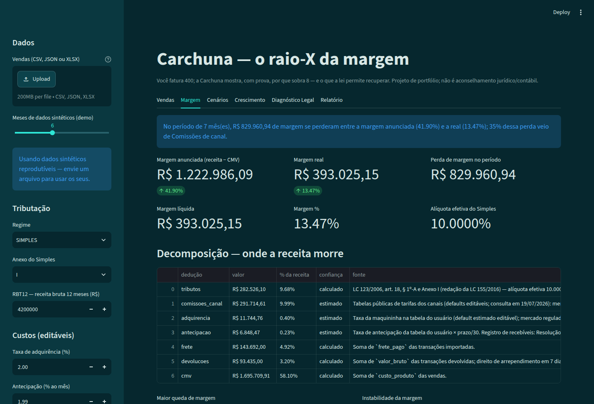
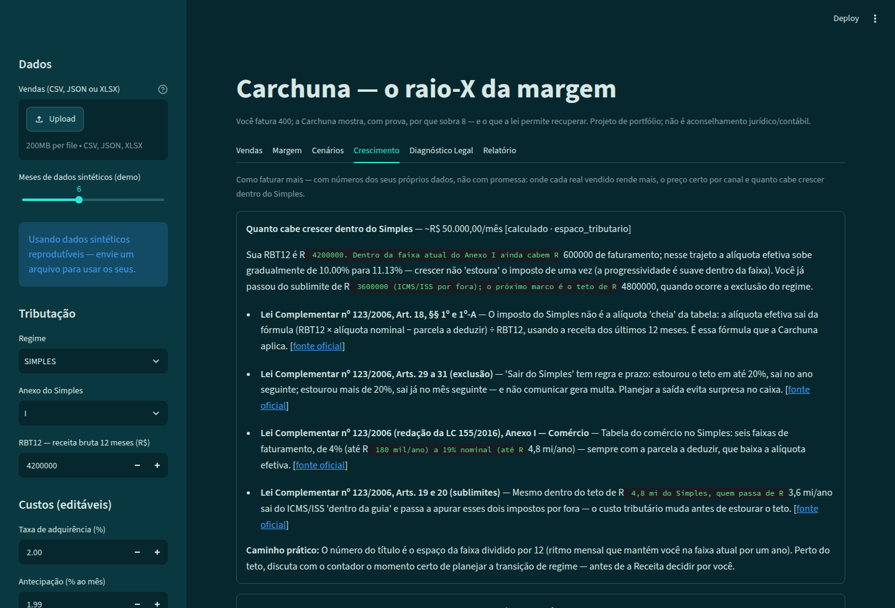
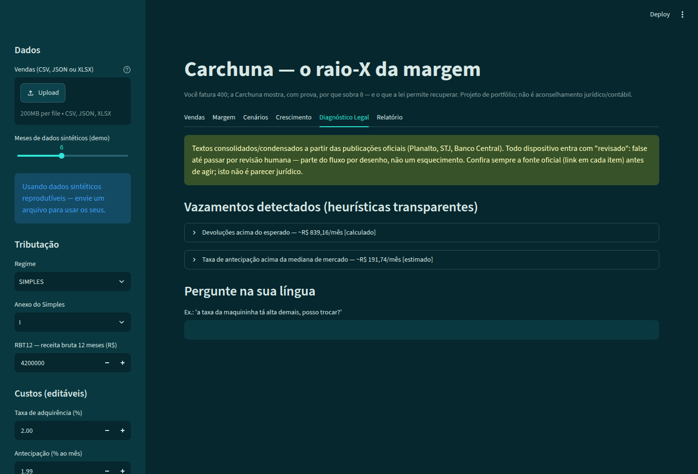

<div align="center">

# Carchuna

**Inteligência de margem para o PME brasileiro. Você fatura 400; a Carchuna mostra, com prova, por que sobra 8 — e onde está o caminho para sobrar (e faturar) mais.**

*(Como a praia de Carchuna, na costa de Granada: águas transparentes onde se vê o fundo.)*

[](https://github.com/robertochiocca/carchuna/actions/workflows/ci.yml)
[](https://www.python.org/)
[](tests/)
[](.github/workflows/ci.yml)
[](https://github.com/psf/black)
[](https://github.com/astral-sh/ruff)
[](LICENSE)

**[App ao vivo / Live app](https://carchuna.streamlit.app)** · **[Site do projeto](https://robertochiocca.github.io/carchuna/)** · **[Tutorial para leigos (do zero)](TUTORIAL.md)** · **[Tutorial em PDF](docs/TUTORIAL.pdf)**

[Português](#o-problema) · [English](#english-version)

</div>

> **Conceito / projeto de portfólio — não é uma empresa nem aconselhamento jurídico/contábil.** Este repositório estuda como uma plataforma de inteligência de margem para PMEs brasileiras *poderia* funcionar. O que está implementado tem teste e CI; o que não está é roadmap explicitamente sinalizado.

---

## O problema

O lojista faz a conta ingênua — **receita − custo do produto = "lucro"** — mas o lucro morre no caminho: impostos, comissão de marketplace, taxa da maquininha, antecipação de recebíveis, frete, devoluções. O CNPJ típico deste estudo fatura **~R$ 400 mil/mês e lucra ~2%**, vende no Mercado Livre/Shopee/Amazon, está no Simples Nacional e **não sabe exatamente onde a margem morre**. Não pode pagar CFO (R$ 15–30 mil/mês) nem tributarista por hora.

A palavra-chave do produto é **verificável**: nenhum número sai de um chatbot — todo número sai de um motor determinístico testado, e **a IA entra depois do cálculo, nunca antes**.

## O fluxo do produto

```
1. Importação      CSV / Excel / JSON / PDF de vendas, com modo de
                   acompanhamento em tempo real no app local
                   (conectores de API no roadmap)
        ↓
2. Reconstrução    receita → impostos → marketplace → adquirência →
   da margem       antecipação → frete → devoluções → CMV → margem real
                   (do período, mês a mês e VENDA A VENDA)
        ↓
3. Diagnóstico     "No período de 7 mês(es), R$ 833.092,65 de margem se
                    perderam entre a margem anunciada (41,90%) e a real
                    (13,36%); 35% dessa perda veio de Comissões de canal."
        ↓
4. Simulação e     "Migração de 30% das vendas de mercado_livre para
   crescimento      loja_propria: impacto R$ +26.313,31 (+0,90 p.p.)"
                   "Onde crescer rende mais · preço para a margem alvo ·
                    quanto cabe faturar dentro da sua faixa do Simples"
        ↓
5. Explicação      base legal citada com fonte oficial (LC 123, CTN, CDC,
   legal/IA        Bacen…) — depois do cálculo, com aviso em toda resposta
```

A venda de R$ 100 decomposta pelo motor (caso conferido à mão nos testes):

```
Receita bruta:                 R$ 100,00
(-) Tributos (Simples, 5,65%): R$   5,65   ← LC 123/2006, art. 18, § 1º-A
(-) Comissão marketplace:      R$  12,00   ← tabela pública do canal (editável)
(-) Frete:                     R$  10,00
(-) Custo do produto (CMV):    R$  40,00
------------------------------------------
Margem líquida real:           R$  32,35   (32,35% — não os 60% "anunciados")
```

## O app

**No ar em [carchuna.streamlit.app](https://carchuna.streamlit.app)** — e o fluxo é um upload só: envie a planilha de vendas (CSV, Excel, JSON ou PDF com tabela) e TODAS as abas se recalculam — margem real, impostos pela LC 123 (a **RBT12 é sugerida automaticamente a partir do próprio arquivo**, editável), produtos campeões e vilões, histórico, cenários, crescimento e diagnóstico legal. O que o arquivo não tem como dizer — seu anexo do Simples e as taxas do seu contrato — fica em dois campos na barra lateral, com explicação de onde encontrar cada um.

No Resumo, a **cachoeira da margem** mostra o dinheiro descendo do faturamento ao que sobrou — e cada barra de custo é clicável: abre a composição por canal e por mês. Logo abaixo, o **Radar do CFO** aponta sozinho o que merece atenção (uma dedução subindo entre os meses, produtos vendendo com margem magra, um mês fora do padrão), cada sinal com severidade e impacto em R$/mês calculado pelo motor. E a aba **Caixa** projeta o fôlego financeiro: a agenda do que as vendas já feitas vão depositar, contra as contas do mês — sem prever venda futura, porque agenda não é bola de cristal.







Nunca programou? O **[TUTORIAL.md](TUTORIAL.md)** leva do zero absoluto (instalar o Python) até o raio-X com as suas vendas — incluindo como exportar o relatório da Shopee/Mercado Livre e montar o CSV a partir do [modelo pronto](examples/vendas_exemplo.csv).

## Por que "Carchuna"?

Os projetos desta trilogia carregam nomes da costa da Andaluzia, de onde a minha família veio — a tradição começou na [Calahonda](https://github.com/robertochiocca/calahonda), batizada em homenagem a essa origem (*Sitio de Calahonda, Mijas, Málaga*). **Carchuna** continua a linhagem com uma coincidência que parece proposital: na costa de Granada, a praia de Carchuna fica colada em outra praia chamada… *Calahonda*. Os dois nomes são vizinhos no mesmo litoral, como os dois projetos são vizinhos no mesmo portfólio — motores irmãos, um para quem investe, outro para quem vende.

E o nome também é a tese do produto: as águas de Carchuna são transparentes a ponto de se ver o fundo. É exatamente o que a plataforma faz com a margem do PME — **água clara, fundo visível, nenhum número sem prova**.

## DNA da trilogia (inegociável)

Terceira plataforma de uma trilogia andaluza: [Calahonda](https://github.com/robertochiocca/calahonda) (quant para gestoras) · [DireitoAberto](https://github.com/robertochiocca/direitoaberto) (legal RAG para o cidadão) · **Carchuna** (os dois motores, casados, para o PME).

1. **Nenhuma afirmação sem lastro** — toda saída ou é calculada por código testado, ou é citada de fonte oficial com link. A IA nunca inventa.
2. **Degradação graciosa** — funciona de ponta a ponta **sem chave de API**: cálculo local + modo extrativo.
3. **PT-BR do lojista** — "maquininha" → adquirência, "antecipar" → antecipação de recebíveis, "ML" → Mercado Livre.
4. **Honestidade técnica** — a tabela de status separa o implementado do roadmap; dispositivos legais entram com `"revisado": false` até revisão humana.
5. **Camadas trocáveis** — motores atrás de interfaces estáveis (padrão `Retriever` do DireitoAberto).
6. **Dinheiro é `Decimal`** — `float` em campo monetário é rejeitado com `TypeError`; na API, dinheiro trafega como *string* no JSON.

## Arquitetura (orientada a objetos, camadas trocáveis)

```
AnalisadorMargem (fachada)          ← analise.py: um objeto, os quatro motores
├── motor de margem                 ← margem.py: decompor_margem + Decimal
│     └── margem_por_venda()        ← a mesma decomposição, venda a venda
├── métricas                        ← metricas.py: queda, instabilidade, lucro
├── Cenario (ABC)                   ← cenarios.py: cada cenário é uma classe
│     ├── CenarioComissao           │  que só sabe TRANSFORMAR as entradas;
│     ├── CenarioAntecipacao        │  a base reexecuta o motor testado e
│     ├── CenarioDevolucoesDobram   │  compara antes/depois
│     ├── CenarioMudancaAnexo       │
│     ├── CenarioMigracaoCanal      ← "e se 30% do ML virasse canal próprio?"
│     └── CenarioPreco              ← "e se eu subisse os preços 5%?"
├── MotorDiagnostico                ← diagnostico.py: orquestra as regras
│     └── RegraDeteccao (ABC)       ← 4 heurísticas transparentes; estender =
│                                      herdar e registrar (aberto/fechado)
├── MotorInsights                   ← insights.py: o Radar do CFO
│     └── AnaliseInsight (ABC)      ← severidade + impacto R$/mês, sem ML
├── caixa.py                        ← agenda de recebíveis + fôlego de caixa
├── Retriever (BM25 + sinônimos)    ← rag/: base legal citada, LLM opcional
└── API FastAPI + Pydantic          ← api/: casca fina e stateless em /api/v1
```

O núcleo é **Python puro, zero dependências** — Streamlit, matplotlib e FastAPI são cascas opcionais em volta do mesmo motor. A parte determinística é 100% testável sem LLM; a parte generativa nunca calcula.

## Status honesto (o que existe vs. roadmap)

| Módulo | Status |
|---|---|
| `margem.py` — decomposição com alíquota efetiva do Simples (LC 123/2006, art. 18, § 1º-A; Anexos I–V) | pronto — implementado e testado |
| `analise.py` — fachada `AnalisadorMargem`, resumo executivo ("quanto se perdeu e de onde veio"), **margem venda a venda** e **margem por produto** (campeões e vilões do catálogo) | pronto — implementado e testado |
| `dados.py` — importação CSV/JSON/XLSX (vírgula decimal BR) + **PDF com tabela no layout do modelo** (beta) + dados sintéticos reprodutíveis | pronto — implementado e testado |
| `metricas.py` — margem mês a mês, maior queda, instabilidade, lucro acumulado | pronto — implementado e testado |
| `cenarios.py` — **preços +X% (mesmo volume)**, comissão +2 p.p., Selic +3 p.p., devoluções dobram, mudança de anexo, **migração de canal**, **vender X% a mais em um canal** | pronto — implementado e testado |
| `insights.py` — **Radar do CFO**: tendência de custos entre meses, produtos de margem magra (com o ganho exato de um reajuste) e mês fora do padrão (2σ), com severidade e impacto em R$/mês | pronto — implementado e testado |
| `caixa.py` — **projeção de caixa**: agenda de recebíveis das vendas já feitas (`calculado`) contra saídas mensais informadas (`estimado`), primeiro dia no vermelho e dias de fôlego | pronto — implementado e testado |
| `crescimento.py` — **como faturar mais, com prova**: mix de canais (onde cada real rende mais), calculadora de preço (motor invertido, preço de equilíbrio e preço-alvo) e espaço para crescer dentro do Simples (faixa, sublimite, teto) | pronto — implementado e testado |
| `rag/` — BM25 + sinônimos do lojista + LLM opcional com fallback extrativo | pronto — implementado e testado |
| `data/corpus_pme.json` — 21 dispositivos (LC 123, CDC, CTN, Bacen, LGPD…) | ingerido — **revisão humana pendente** (`revisado: false`) |
| `diagnostico.py` — `MotorDiagnostico` com 4 regras plugáveis gerando achados com base legal | pronto — implementado e testado |
| `api/` — FastAPI + Pydantic, stateless, `/api/v1` com OpenAPI em `/docs` | pronto — implementado e testado |
| `conectores/` — interface `Conector` + `ConectorArquivo` (CSV/JSON/XLSX de qualquer canal, com filtro de período) | pronto — implementado e testado |
| Site do projeto (GitHub Pages) com demo de decomposição no navegador + tutorial para leigos | pronto |
| Conector **Shopee API** (Open Platform: app aprovado + OAuth do lojista; `get_escrow_detail` traz a comissão real por pedido) | roadmap — mesma interface `Conector` |
| Conector **Mercado Livre API** (app registrado + OAuth; `/orders/search` e `/billing`) | roadmap — mesma interface `Conector` |
| `relatorio.py` — PDF de 3 páginas (raio-X, cenários, achados) | pronto — implementado e testado |
| `app.py` — dashboard Streamlit com 8 abas em linguagem de lojista (Resumo com **cachoeira da margem clicável** e **Radar do CFO**, Vendas e Produtos, Histórico, E se…?, Crescer, **Caixa**, Diagnóstico Legal, Relatório), bilíngue PT/EN | pronto (sem teste automatizado de UI) |
| Autenticação da API (PBKDF2 + Bearer) e persistência (SQLAlchemy; SQLite → PostgreSQL via env) | roadmap — quando houver piloto multiusuário |
| Regime **Lucro Presumido** | roadmap (depende de ICMS/ISS estaduais/municipais) |
| RBT12 móvel mês a mês nas séries | roadmap |
| Open Finance via agregador (Pluggy/Belvo) | roadmap |
| MCP server (consultar a Carchuna por assistentes de IA) | roadmap |
| Busca semântica (embeddings/ChromaDB, opt-in) | roadmap |
| **Elasticidade de preço** (quanto de volume se perde ao subir o preço) | roadmap — exige histórico de variação de preço que a planilha de vendas não traz; até lá, os cenários de preço declaram "mesmo volume" como premissa |
| **CAC/LTV por canal** (economia do cliente) | roadmap — exige dados de aquisição (gasto com anúncio, recompra) que não existem no relatório de vendas |
| **Contas a pagar reais** no fluxo de caixa (vencimento a vencimento) | roadmap — hoje as saídas são uma média mensal informada pelo usuário, diluída por dia (simplificação documentada) |
| ML preditivo (previsão de vendas) | roadmap — heurísticas transparentes primeiro |

**Meta antes de qualquer conector:** 1 lojista piloto usando com CSV real.

## Como rodar

```bash
git clone https://github.com/robertochiocca/carchuna.git
cd carchuna

# O núcleo é Python puro (zero dependências): exemplo e testes rodam offline
python examples/exemplo_diagnostico.py
pip install pytest && pytest          # 94 testes

# Dashboard e API
pip install -r requirements.txt
streamlit run app.py                            # dashboard (5 abas)
uvicorn carchuna.api.main:app --reload          # API — OpenAPI em /docs
```

Em três linhas de Python:

```python
from carchuna import AnalisadorMargem

analise = AnalisadorMargem.demo(meses=6)   # ou .de_arquivo("vendas.csv", config)
print(analise.resumo_executivo().frase())
# No período de 7 mês(es), R$ 833.092,65 de margem se perderam entre a margem
# anunciada (41.90%) e a real (13.36%); 35% dessa perda veio de Comissões de canal.
```

Com `ANTHROPIC_API_KEY` configurada, as respostas do diagnóstico ganham narrativa em linguagem natural (API da Anthropic); **sem chave, tudo funciona em modo extrativo** — o cálculo nunca depende de LLM.

### Publicação (site e app no ar)

- **Site** ([robertochiocca.github.io/carchuna](https://robertochiocca.github.io/carchuna/)): o workflow `pages.yml` publica a `index.html` na branch `gh-pages` a cada push na `main`; na primeira vez, ative em *Settings → Pages → Branch: gh-pages*.
- **App ao vivo**: [carchuna.streamlit.app](https://carchuna.streamlit.app), publicado no Streamlit Community Cloud a partir da `main` — cada mescla atualiza o app sozinho.

## Como cada número ganha lastro

- **Tributos**: fórmula oficial da alíquota efetiva (LC 123/2006, art. 18, § 1º-A) com os Anexos I–V na redação da LC 155/2016, validada por testes calculados à mão — inclusive o degrau da 6ª faixa, em que o ICMS/ISS saem da guia pelo sublimite (arts. 19 e 20). A conferência automática no Planalto foi tentada em 19/07/2026 (portal retornou HTTP 503 a robôs); a data e a ressalva estão documentadas em `carchuna/margem.py`.
- **Comissões/adquirência/antecipação**: tabelas **editáveis pelo usuário**, com defaults documentados com fonte e marcados `estimado` — o seu contrato prevalece.
- **Invariante contábil testado**: soma das deduções + margem líquida == receita bruta, centavo a centavo.
- **Base legal dos achados**: apenas o que o `Retriever` recuperou do corpus versionado — com link oficial e status de revisão em cada citação. Fluxo: pergunta → busca no corpus → recuperação dos trechos → LLM interpreta (opcional) → cita fonte → aviso.
- **Excel**: células numéricas chegam como `float` do openpyxl; a conversão passa por `str()` e esta é a única exceção documentada à regra do `Decimal` — prefira CSV.

## O que a Carchuna **não** é (anti-escopo)

Não é ERP (não emite nota, não controla estoque); **não dá parecer jurídico nem promete recuperação tributária** ("você tem direito a R$ X de volta" — nunca; esse mercado é infestado de golpes de "teses"); não é a Calahonda (sem VaR/carteira); não importa o corpus B2C do DireitoAberto; sem ML preditivo, score de crédito ou decisão financeira automatizada na v1; sem armazenar credenciais bancárias; sem scraping de portais que bloqueiam robôs.

## Qualidade

`pytest` (94 testes, cobertura 97%, mínimo 85% no CI) · `ruff` · `black` · GitHub Actions em Python 3.10, 3.11 e 3.12. Padrão de teste: casos validados contra cálculo manual (o "VaR ≈ 1.645σ" daqui é a alíquota do Simples conferida à mão), invariantes contábeis e a API respondida com os mesmos centavos do motor.

**Stack:** Python 3.10+ (núcleo sem dependências) · FastAPI · Pydantic · Streamlit · matplotlib · pytest

---

## English version

**Carchuna** — verifiable margin intelligence for Brazilian SMBs. It rebuilds a seller's real margin deterministically (taxes, marketplace fees, card acquiring, receivables prepayment, freight, returns, COGS) — for the period, per month and **per sale** — quantifies where profit died ("R$ 833k of margin lost; 35% came from marketplace fees"), simulates alternatives (channel migration, fee shocks, tax bracket changes) and only then uses RAG over official legal sources to explain, with citations. **AI comes after the math, never before.** Third project of an Andalusian trilogy ([Calahonda](https://github.com/robertochiocca/calahonda) → quant, [DireitoAberto](https://github.com/robertochiocca/direitoaberto) → legal RAG).

Core principles: every output is either computed by tested code or cited from an official source with a link; graceful degradation (fully functional without any API key); money is `Decimal`, never `float` (serialized as strings over the API); legal corpus entries ship with `"revisado": false` until human review; object-oriented engines behind stable interfaces (`AnalisadorMargem` facade, `Cenario`/`RegraDeteccao` class hierarchies); honest README separating implemented (tests + CI) from roadmap.

Live app: [carchuna.streamlit.app](https://carchuna.streamlit.app) · project site: [robertochiocca.github.io/carchuna](https://robertochiocca.github.io/carchuna/).

```bash
python examples/exemplo_diagnostico.py       # zero dependencies, fully offline
pytest                                        # 94 tests, 97% coverage
streamlit run app.py                          # dashboard
uvicorn carchuna.api.main:app --reload        # FastAPI + Pydantic, /docs
```

> Concept / portfolio project — not a company, not legal or accounting advice.

## Licença

[MIT](LICENSE) — © 2026 Roberto Chiocca
