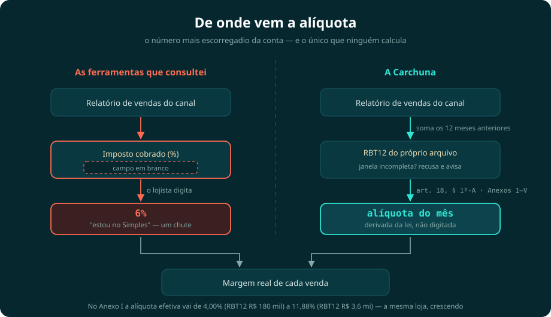
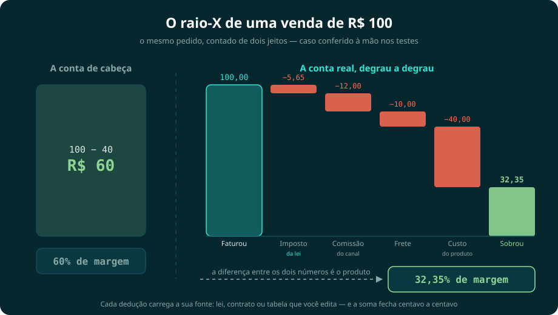
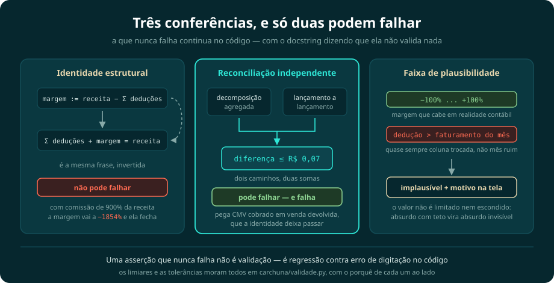

<div align="center">

# Carchuna

**Toda calculadora de lucro de marketplace pede que você digite o seu percentual de imposto; a Carchuna calcula esse percentual a partir da lei — pelo seu anexo, pela sua faixa e pelo mês de apuração — e é por isso que dá para ver o fundo da sua margem.**

*(Como a praia de Carchuna, na costa de Granada: águas transparentes onde se vê o fundo.)*

[](https://github.com/robertochiocca/carchuna/actions/workflows/ci.yml)
[](https://www.python.org/)
[](tests/)
[](.github/workflows/ci.yml)
[](https://github.com/psf/black)
[](https://github.com/astral-sh/ruff)
[](LICENSE)

**[App ao vivo / Live app](https://carchuna.streamlit.app)** · **[Site do projeto](https://robertochiocca.github.io/carchuna/)** · **[Tutorial para leigos (do zero)](TUTORIAL.md)** · **[Tutorial em PDF](docs/TUTORIAL.pdf)**

[Português](#o-problema) · [English](#english-version)

<br>



</div>

> **Conceito / projeto de portfólio — não é uma empresa nem aconselhamento jurídico/contábil.** Este repositório estuda como uma plataforma de inteligência de margem para PMEs brasileiras *poderia* funcionar. O que está implementado tem teste e CI; o que não está é roadmap explicitamente sinalizado.

---

## O problema

O lojista faz a conta ingênua — **receita − custo do produto = "lucro"** — mas o lucro morre no caminho: impostos, comissão de marketplace, taxa da maquininha, antecipação, frete, devoluções. O CNPJ típico deste estudo fatura **~R$ 400 mil/mês e lucra ~2%**, vende no Mercado Livre/Shopee/Amazon, está no Simples Nacional e não pode pagar CFO nem tributarista por hora.

Refazer essa conta com as taxas certas é a parte que o mercado brasileiro já resolve: conciliadores pedido a pedido e calculadoras gratuitas de lucro de marketplace fazem isso. Só que todos eles pedem uma coisa que o lojista não tem — **o percentual de imposto**. As ferramentas de precificação e conciliação que consultei trazem esse número como *entrada do usuário*: um campo em branco, com um rótulo do tipo "Imposto cobrado (%): Simples Nacional, etc.".

O lojista digita 6% porque "está no Simples", e o resto da conta herda esse chute com aparência de cálculo. E ele não erra por descuido: **a alíquota efetiva não é um número que se saiba de cabeça**. Ela muda por anexo, muda por faixa de faturamento e muda **de um mês para o outro**, porque a lei manda calcular cada mês de apuração sobre a receita dos doze meses anteriores àquele mês (LC 123/2006, art. 18, § 1º e § 1º-A). Só dentro do Anexo I, a alíquota efetiva sai de 4,00% com RBT12 de R$ 180 mil e chega a 11,88% com RBT12 de R$ 3,6 milhões (números do próprio motor, conferíveis em `margem.py`) — a mesma loja, crescendo, paga percentuais diferentes ao longo do próprio ano. Quem digitou 6% e paga 11,88% errou quase seis pontos percentuais, e esse erro não estraga um item do relatório: ele incide sobre o faturamento inteiro e contamina todo número que vier depois.

É por isso que a Carchuna não tem esse campo. A alíquota é derivada da fórmula do art. 18, § 1º-A, com os Anexos I–V (redação da LC 155/2016), e a RBT12 é sugerida a partir do próprio arquivo de vendas — mês a mês, com recusa honesta nos meses em que o arquivo não cobre a janela inteira dos doze meses.

> Todo mundo reconcilia o que o marketplace já te cobrou.
> A Carchuna calcula o que **a lei** te cobra.

A palavra-chave do produto é **verificável**: nenhum número sai de um chatbot — todo número sai de um motor determinístico testado, e **a IA entra depois do cálculo, nunca antes**. Três coisas sustentam isso:

- **O motor é reversível.** `crescimento.py` inverte o mesmo `decompor_margem` para dar preço de equilíbrio e preço-alvo. Diagnóstico e precificação não podem divergir: é o mesmo código nas duas direções.
- **O crescimento é amarrado à faixa do Simples.** Sublimite de ICMS/ISS, fim de faixa, teto de exclusão — quanto ainda cabe faturar antes de a conta mudar.
- **Dinheiro é `Decimal`, e o número é reconferido por outro caminho.** A margem é recomposta lançamento a lançamento e comparada com a do motor, dentro de tolerância declarada — dois caminhos, duas somas. É essa conferência que pode falhar, e é por isso que ela vale.

## O fluxo do produto

```
1. Importação      CSV / Excel / JSON / PDF de vendas, com modo de
                   acompanhamento em tempo real no app local
                   (conectores de API no roadmap)
        ↓
2. Reconstrução    receita → impostos → marketplace → adquirência →
   da margem       antecipação → frete → devoluções → CMV → margem real
                   (do período, mês a mês e VENDA A VENDA)
        ↓
3. Diagnóstico     "No período de 7 mês(es), R$ 833.092,65 de margem se
                    perderam entre a margem anunciada (41,90%) e a real
                    (13,36%); 35% dessa perda veio de Comissões de canal."
        ↓
4. Simulação e     "Migração de 30% das vendas de mercado_livre para
   crescimento      loja_propria: impacto R$ +26.313,31 (+0,90 p.p.)"
                   "Onde crescer rende mais · preço para a margem alvo ·
                    quanto cabe faturar dentro da sua faixa do Simples"
        ↓
5. Explicação      base legal citada com fonte oficial (LC 123, CTN, CDC,
   legal/IA        Bacen…) — depois do cálculo, com aviso em toda resposta
```

A venda de R$ 100 decomposta pelo motor — caso conferido à mão nos testes, e as barras do desenho estão em escala (250 px valem R$ 100):

<div align="center">



</div>

Os mesmos números, com a fonte de cada dedução anotada:

```
Receita bruta:                 R$ 100,00
(-) Tributos (Simples, 5,65%): R$   5,65   ← LC 123/2006, art. 18, § 1º-A
(-) Comissão marketplace:      R$  12,00   ← tabela pública do canal (editável)
(-) Frete:                     R$  10,00
(-) Custo do produto (CMV):    R$  40,00
------------------------------------------
Margem líquida real:           R$  32,35   (32,35% — não os 60% "anunciados")
```

## O app

**No ar em [carchuna.streamlit.app](https://carchuna.streamlit.app)** — e o fluxo é um upload só: envie a planilha de vendas (CSV, Excel, JSON ou PDF com tabela) e TODAS as abas se recalculam — margem real, impostos pela LC 123 (a **RBT12 é sugerida automaticamente a partir do próprio arquivo**, editável), produtos campeões e vilões, histórico, cenários, crescimento e diagnóstico legal. O que o arquivo não tem como dizer — seu anexo do Simples e as taxas do seu contrato — fica em dois campos na barra lateral, com explicação de onde encontrar cada um.


Nunca programou? O **[TUTORIAL.md](TUTORIAL.md)** leva do zero absoluto (instalar o Python) até o raio-X com as suas vendas — incluindo como exportar o relatório da Shopee/Mercado Livre e montar o CSV a partir do [modelo pronto](examples/vendas_exemplo.csv).

## Por que "Carchuna"?

Os projetos desta trilogia carregam nomes da costa da Andaluzia, de onde a minha família veio — a tradição começou na [Calahonda](https://github.com/robertochiocca/calahonda), batizada em homenagem a essa origem (*Sitio de Calahonda, Mijas, Málaga*). **Carchuna** continua a linhagem com uma coincidência que parece proposital: na costa de Granada, a praia de Carchuna fica colada em outra praia chamada… *Calahonda*. Os dois nomes são vizinhos no mesmo litoral, como os dois projetos são vizinhos no mesmo portfólio — motores irmãos, um para quem investe, outro para quem vende.

E o nome também é a tese do produto: as águas de Carchuna são transparentes a ponto de se ver o fundo. É exatamente o que a plataforma faz com a margem do PME — **água clara, fundo visível, nenhum número sem prova**.

## DNA da trilogia (inegociável)

Terceira plataforma de uma trilogia andaluza: [Calahonda](https://github.com/robertochiocca/calahonda) (quant para gestoras) · [DireitoAberto](https://github.com/robertochiocca/direitoaberto) (legal RAG para o cidadão) · **Carchuna** (os dois motores, casados, para o PME).

1. **Nenhuma afirmação sem lastro** — toda saída ou é calculada por código testado, ou é citada de fonte oficial com link. A IA nunca inventa.
2. **Degradação graciosa** — funciona de ponta a ponta **sem chave de API**: cálculo local + modo extrativo.
3. **PT-BR do lojista** — "maquininha" → adquirência, "antecipar" → antecipação de recebíveis, "ML" → Mercado Livre.
4. **Honestidade técnica** — a tabela de status separa o implementado do roadmap; dispositivos legais entram com `"revisado": false` até revisão humana.
5. **Camadas trocáveis** — motores atrás de interfaces estáveis (padrão `Retriever` do DireitoAberto).
6. **Dinheiro é `Decimal`** — `float` em campo monetário é rejeitado com `TypeError`; na API, dinheiro trafega como *string* no JSON.

## Arquitetura (orientada a objetos, camadas trocáveis)

```
AnalisadorMargem (fachada)          ← analise.py: um objeto, os quatro motores
├── motor de margem                 ← margem.py: decompor_margem + Decimal
│     └── margem_por_venda()        ← a mesma decomposição, venda a venda
├── métricas                        ← metricas.py: queda, instabilidade, lucro
├── Cenario (ABC)                   ← cenarios.py: cada cenário é uma classe
│     ├── CenarioComissao           │  que só sabe TRANSFORMAR as entradas;
│     ├── CenarioAntecipacao        │  a base reexecuta o motor testado e
│     ├── CenarioDevolucoesDobram   │  compara antes/depois
│     ├── CenarioMudancaAnexo       │
│     └── CenarioMigracaoCanal      ← "e se 30% do ML virasse canal próprio?"
├── MotorDiagnostico                ← diagnostico.py: orquestra as regras
│     └── RegraDeteccao (ABC)       ← 4 heurísticas transparentes; estender =
│                                      herdar e registrar (aberto/fechado)
├── Retriever (BM25 + sinônimos)    ← rag/: base legal citada, LLM opcional
└── API FastAPI + Pydantic          ← api/: casca fina e stateless em /api/v1
```

O núcleo é **Python puro, zero dependências** — Streamlit, matplotlib e FastAPI são cascas opcionais em volta do mesmo motor. A parte determinística é 100% testável sem LLM; a parte generativa nunca calcula.

## Status honesto (o que existe vs. roadmap)

| Módulo | Status |
|---|---|
| `margem.py` — **a alíquota não é digitada, é derivada**: fórmula do art. 18, § 1º-A da LC 123/2006 com os Anexos I–V (redação da LC 155/2016), RBT12 sugerida do próprio arquivo de vendas e **alíquota por mês de apuração**, calculada sobre os doze meses anteriores àquele mês. Traz também as três conferências (identidade estrutural, reconciliação independente e faixa de plausibilidade) | pronto — implementado e testado |
| `metricas.py` — **RBT12 móvel mês a mês** (art. 18, § 1º): cada mês é tributado pela receita dos seus doze meses anteriores; nos meses em que o arquivo não cobre a janela inteira vale a RBT12 informada, e a tela diz quantos meses foram de cada tipo — em vez de completar o buraco com zero. Também: margem mês a mês, maior queda, instabilidade, lucro acumulado e a decomposição do Δlucro entre dois meses pela identidade contábil | pronto — implementado e testado |
| `analise.py` — fachada `AnalisadorMargem`, resumo executivo ("quanto se perdeu e de onde veio"), **margem venda a venda**, **margem por produto** (campeões e vilões do catálogo) e a composição de cada dedução por canal e por mês | pronto — implementado e testado |
| `dados.py` — importação de export CRU de marketplace: encoding do Excel BR (latin-1/cp1252), linhas de título antes do cabeçalho, separador `;`/`,`/tab, vírgula decimal, datas em formatos mistos, **relatório de linhas recusadas** e mensagem que diz onde achar a coluna que faltou + PDF com tabela no layout do modelo (beta) + dados sintéticos reprodutíveis | pronto — implementado e testado (fixtures cruas em `tests/fixtures/reais/`) |
| `validade.py` — o motor se recusa a responder onde não há resposta: `ok`, `indefinido` e `implausivel` com motivo em PT-BR, mais os limiares de plausibilidade e as tolerâncias de arredondamento, todos num lugar só | pronto — implementado e testado |
| `tipos.py` — a coluna de devolução do marketplace vem como **status** ("Solicitação aprovada", "Em análise"), não como sim/não: separa tipo físico, tipo estatístico e significado de negócio, e nunca converte status intermediário em silêncio | pronto — implementado e testado |
| `linhagem.py` — a ficha de "como chegamos a este número": arquivo de origem, colunas usadas, transformações da importação, fórmula com os parâmetros do caso, premissas, limitações, base legal e hora do cálculo | pronto — implementado e testado |
| `confianca.py` — nota 0–100 explicável (evidência, histórico, amostra, completude), com o motivo de cada componente em texto; separa "os dados mostram isso" de "esta é uma hipótese" | pronto — implementado e testado |
| `insights.py` — radar de margem: detecção estatística (z-score com cerca de IQR, média móvel, divergência receita × lucro) e narrativa com esperado × observado, impacto em R$/mês e o **método declarado na tela** | pronto — implementado e testado |
| `benchmarks.py` — comparações com `tipo_fonte` explícito, incluindo `indisponivel` quando não há fonte gratuita auditável | pronto — implementado e testado |
| `cenarios.py` — comissão +2 p.p., Selic +3 p.p., devoluções dobram, mudança de anexo, **migração de canal**, **vender X% a mais em um canal**, **subir os preços X%** (com a premissa de volume constante no nome do cenário) | pronto — implementado e testado |
| `crescimento.py` — **como faturar mais, com prova**: mix de canais (onde cada real rende mais), calculadora de preço (motor invertido, preço de equilíbrio e preço-alvo) e espaço para crescer dentro do Simples (faixa, sublimite, teto) | pronto — implementado e testado |
| `rag/` — BM25 + sinônimos do lojista + LLM opcional com fallback extrativo | pronto — implementado e testado |
| `rag/ingestao.py` + `scripts/ingerir_planalto.py` — extrai artigos de uma lei do Planalto (incluindo `Art. 18-A`, que a LC 123 usa à exaustão) e gera esqueletos no formato do corpus; a mesclagem nunca sobrescreve dispositivo com conteúdo humano | pronto — implementado e testado. Resolve a **digitação**, não a conferência: todo esqueleto sai `revisado: false` com resumo TODO |
| `data/corpus_pme.json` — 21 dispositivos (LC 123, CDC, CTN, Bacen, LGPD…) | bloqueado por humano — conferir cada dispositivo na fonte oficial e virar `revisado: true` no arquivo; só o Roberto (ou um advogado) pode fazer isso |
| `diagnostico.py` — `MotorDiagnostico` com 4 regras plugáveis gerando achados com base legal | pronto — implementado e testado |
| `api/` — FastAPI + Pydantic, stateless, `/api/v1` com OpenAPI em `/docs` | pronto — implementado e testado |
| `conectores/` — interface `Conector` + `ConectorArquivo` (CSV/JSON/XLSX de qualquer canal, com filtro de período) | pronto — implementado e testado |
| Site do projeto (GitHub Pages) com demo de decomposição no navegador + tutorial para leigos | pronto — implementado e testado: as tabelas do Simples E a fórmula em JavaScript da demo são conferidas contra `margem.py` a cada CI |
| Conector **Shopee API** (Open Platform: `get_escrow_detail` traz a comissão real por pedido) | bloqueado por humano — depende de registrar o app na Shopee Open Platform e obter aprovação + OAuth do lojista; a interface `Conector` e o `ConectorArquivo` já existem e são testados |
| Conector **Mercado Livre API** (`/orders/search` e `/billing`) | bloqueado por humano — depende de registrar o app no Mercado Livre e obter OAuth do lojista; mesma interface `Conector` |
| `relatorio.py` — PDF de 3 páginas (raio-X, cenários, achados) | pronto — implementado e testado |
| `app.py` — dashboard Streamlit com 7 abas em linguagem de lojista (Resumo, Vendas e Produtos, Histórico, E se…?, Crescer, Diagnóstico Legal, Relatório), bilíngue PT/EN | pronto — implementado e testado (`streamlit.testing.v1.AppTest`) |
| Autenticação da API (PBKDF2 + Bearer) e persistência (SQLAlchemy; SQLite → PostgreSQL via env) | roadmap — quando houver piloto multiusuário |
| Regime **Lucro Presumido** | roadmap — cada alíquota de ICMS/ISS depende do estado e do município, e a regra da casa é não publicar alíquota que não foi validada em fonte oficial |
| Open Finance via agregador (Pluggy/Belvo) | bloqueado por humano — depende de contrato com o agregador e de credenciais; sem isso não se escreve integração |
| MCP server (consultar a Carchuna por assistentes de IA) | roadmap — a API `/api/v1` já expõe o motor; o MCP só faz sentido depois de um piloto que peça esse acesso |
| Busca semântica (embeddings/ChromaDB, opt-in) | roadmap — o BM25 com sinônimos do lojista responde o corpus de 21 dispositivos; embeddings só se pagam com corpus grande |
| ML preditivo (previsão de vendas) | roadmap — heurísticas transparentes primeiro |

**Meta antes de qualquer conector:** 1 lojista piloto usando com CSV real.

## Como rodar

```bash
git clone https://github.com/robertochiocca/carchuna.git
cd carchuna

# O núcleo é Python puro (zero dependências): exemplo e testes rodam offline
python examples/exemplo_diagnostico.py
pip install pytest && pytest          # 519 testes

# Dashboard e API
pip install -r requirements.txt
streamlit run app.py                            # dashboard (7 abas)
uvicorn carchuna.api.main:app --reload          # API — OpenAPI em /docs
```

Em três linhas de Python:

```python
from carchuna import AnalisadorMargem

analise = AnalisadorMargem.demo(meses=6)   # ou .de_arquivo("vendas.csv", config)
print(analise.resumo_executivo().frase())
# No período de 7 mês(es), R$ 833.092,65 de margem se perderam entre a margem
# anunciada (41.90%) e a real (13.36%); 35% dessa perda veio de Comissões de canal.
```

A narrativa em linguagem natural vem **desligada de fábrica**: ligue com `CARCHUNA_USAR_LLM=1` e uma credencial de API no ambiente. Desligada por padrão porque cada pergunta vira uma chamada paga, e quem clona o repositório não deve gastar sem ter pedido. **Sem ela tudo funciona em modo extrativo** — o cálculo nunca depende de LLM, e `/api/v1/saude` diz em português por que a narrativa não está saindo, quando não está.

A pergunta do lojista vai para o modelo **delimitada**, e o prompt manda tratá-la como dado, não como instrução: sem isso, escrever "ignore as regras acima" no campo de busca disputaria autoridade com as regras que proíbem prometer recuperação tributária. `/api/v1/legal/buscar` é também o único endpoint com limite de chamadas — 30 por minuto por IP —, porque é o único que gasta dinheiro de terceiro por requisição; o alcance e os limites dessa barreira estão escritos em `carchuna/api/limite.py`.

### Publicação (site e app no ar)

- **Site** ([robertochiocca.github.io/carchuna](https://robertochiocca.github.io/carchuna/)): o workflow `pages.yml` publica a `index.html` na branch `gh-pages` a cada push na `main`; na primeira vez, ative em *Settings → Pages → Branch: gh-pages*.
- **App ao vivo**: [carchuna.streamlit.app](https://carchuna.streamlit.app), publicado no Streamlit Community Cloud a partir da `main` — cada mescla atualiza o app sozinho.

## Como cada número ganha lastro

<div align="center">



</div>

- **Tributos**: fórmula oficial da alíquota efetiva (LC 123/2006, art. 18, § 1º-A) com os Anexos I–V na redação da LC 155/2016, validada por testes calculados à mão — inclusive o degrau da 6ª faixa, em que o ICMS/ISS saem da guia pelo sublimite (arts. 19 e 20). A conferência automática no Planalto foi tentada em 19/07/2026 (portal retornou HTTP 503 a robôs); a data e a ressalva estão documentadas em `carchuna/margem.py`.
- **Comissões/adquirência/antecipação**: tabelas **editáveis pelo usuário**, com defaults documentados com fonte e marcados `estimado` — o seu contrato prevalece.
- **Cinco conferências diferentes, e cada uma responde por uma coisa só** — a distinção existe porque durante muito tempo eu chamei a primeira de "validação", e ela não é:
  - **Identidade estrutural** (deduções + margem == receita). Prova que o código não perdeu nem duplicou um termo na soma. **Não** prova que os números são válidos e **não** detecta entrada absurda: a margem é construída como resíduo, então a igualdade fecha por definição. Rodando o motor com uma comissão de 900% da receita, a margem sai em −1854% e a identidade fecha normalmente. É teste de regressão de implementação, e é só isso.
  - **Reconciliação independente** (`margem.reconciliar`). Recompõe a margem lançamento a lançamento, a partir dos campos crus, sem passar pela decomposição — dois caminhos, duas somas — e compara com tolerância de **R$ 0,07**, que é meio centavo por linha arredondada e nada além disso. Esta asserção **pode** falhar, e é ela que valida o número: se o motor cobrar CMV sobre uma venda devolvida, a identidade continua fechando e esta não.
  - **Faixa de plausibilidade** (`margem.conferir_plausibilidade`). Dedução isolada maior que o faturamento do período, ou margem fora da faixa de −100% a 100%, saem carimbadas como `implausivel`, com o motivo em português na tela — sem limitar, zerar ou esconder o valor. Os limiares vivem todos em `carchuna/validade.py`, com o porquê de cada um escrito ao lado.
  - **Fechamento percentual** (`margem.conferir_fechamento_percentual`). As três de cima olham reais; os percentuais são outro número, e são eles que aparecem na cachoeira e no resumo. Todo percentual publicado tem de ser fração da **mesma** receita bruta, e a soma das deduções mais a margem tem de dar 100. O buraco que isso fecha é concreto: trocar o denominador do percentual do tributo para a base do tributo (`receita − devoluções`) é uma "correção" plausível — aquela *é* a base legal do art. 3º, § 1º —, e feita a troca os valores em reais continuam certos, a reconciliação diz ok, a identidade fecha, e a tela publica percentuais que somam 101,41%.
  - **Aditividade em pontos de margem** (`metricas.conferir_aditividade_pp`). A comparação entre dois meses tem uma manchete ("a margem subiu 0,66 ponto") e uma cachoeira que a explica linha a linha. As duas têm de dar o mesmo número, e agora dão **exatamente**: os pontos de cada linha saem dos reais em precisão cheia, e o resíduo de arredondamento é repartido por maior-resto — quem mais perdeu no arredondamento recebe o centésimo que falta. Quando o resíduo é grande demais para ser arredondamento, a repartição não acontece e esta conferência reporta a divergência, porque fechar a soma na marra esconderia o driver que está faltando. O limiar não é fixo: `min(1,0 p.p.; 10% da margem do período base)`, porque meio ponto é ruído para quem fecha o mês em 30% e é um sexto do resultado de quem fecha em 3%.
- **As conferências rodam nas duas fronteiras, não só na tela.** Elas viviam em `carchuna/margem.py` sem que a produção as chamasse, com uma exceção: o dashboard rodava a plausibilidade. A API devolvia a decomposição crua — CMV de R$ 5.000 numa venda de R$ 100 saía com HTTP 200 e a mesma cara de um número bom. Hoje `/api/v1/margem/decompor` devolve `conferencias.plausibilidade` e `conferencias.reconciliacao` no corpo (e não em código HTTP: a conta rodou, o número existe, e devolver 4xx esconderia justamente o dado que precisa ser auditado), e o dashboard mostra as duas.
- **Quando não há número, o motor diz isso.** Variação percentual sobre base zero ou negativa é `indefinido`, não um percentual com o sinal trocado: melhorar de −100 para −50 apareceria como queda de 50%. Onde o percentual não vale, respondem a variação em reais e em pontos de margem, que atravessam o zero sem mentir.
- **Base legal dos achados**: apenas o que o `Retriever` recuperou do corpus versionado — com link oficial e status de revisão em cada citação. Fluxo: pergunta → busca no corpus → recuperação dos trechos → LLM interpreta (opcional) → cita fonte → aviso.
- **Excel**: o arquivo `.xlsx` guarda a célula em ponto flutuante — o erro é anterior à Carchuna, e nenhuma conversão desfaz o que já foi arredondado. O que dá para fazer é não deixá-lo entrar: todo `float` que vem de planilha é quantizado a centavos com `ROUND_HALF_UP` na fronteira, antes de virar `Decimal`. Então a garantia é **"o motor nunca calcula em `float`"** — e ela não se estende ao que o Excel arredondou antes de o arquivo chegar. Para dinheiro com mais de duas casas, prefira CSV. Os campos de percentual da barra lateral do dashboard **não** são a segunda exceção: eles são lidos como texto e convertidos pelo mesmo parser das planilhas (`decimal_de_texto`), justamente porque `st.number_input` devolveria `float` — e esse número multiplica cada venda da base. Os `float()` que aparecem no `app.py` e no `relatorio.py` são de desenho de gráfico e de PDF: recebem um `Decimal` já calculado e não voltam para o cálculo.

## O que a Carchuna **não** é (anti-escopo)

Não é ERP (não emite nota, não controla estoque); **não dá parecer jurídico nem promete recuperação tributária** ("você tem direito a R$ X de volta" — nunca; esse mercado é infestado de golpes de "teses"); não é a Calahonda (sem VaR/carteira); não importa o corpus B2C do DireitoAberto; sem ML preditivo, score de crédito ou decisão financeira automatizada na v1; sem armazenar credenciais bancárias; sem scraping de portais que bloqueiam robôs.

## Qualidade

`pytest` (519 testes, cobertura 98,67%, mínimo 95% no CI) · `ruff` · `black` · GitHub Actions em Python 3.10, 3.11 e 3.12. Padrão de teste: casos validados contra cálculo manual (o "VaR ≈ 1.645σ" daqui é a alíquota do Simples conferida à mão), reconciliação da margem por um segundo caminho e a API respondida com os mesmos centavos do motor.

**Stack:** Python 3.10+ (núcleo sem dependências) · FastAPI · Pydantic · Streamlit · matplotlib · pytest

---

## English version

**Carchuna** — every marketplace profit calculator asks the seller to *type in* their tax rate. Carchuna **derives** it from the statute: the formula in art. 18, § 1º-A of Brazil's LC 123/2006, annexes I–V, with the twelve-month revenue base read from the seller's own sales file — and a **separate rate for each accrual month**, computed over the twelve months preceding that month, refusing to guess when the file doesn't cover the full window.

Everybody reconciles what the marketplace already charged you. Carchuna computes what **the law** charges you.

From there it rebuilds the real margin deterministically (taxes, marketplace fees, card acquiring, receivables prepayment, freight, returns, COGS) — for the period, per month and **per sale** — quantifies where profit died ("R$ 833k of margin lost; 35% came from marketplace fees"), simulates alternatives (channel migration, fee shocks, price increases, tax bracket changes) and only then uses RAG over official legal sources to explain, with citations. **AI comes after the math, never before.** Third project of an Andalusian trilogy ([Calahonda](https://github.com/robertochiocca/calahonda) → quant, [DireitoAberto](https://github.com/robertochiocca/direitoaberto) → legal RAG).

Core principles: every output is either computed by tested code or cited from an official source with a link; graceful degradation (fully functional without any API key); money is `Decimal`, never `float` (serialized as strings over the API); legal corpus entries ship with `"revisado": false` until human review; object-oriented engines behind stable interfaces (`AnalisadorMargem` facade, `Cenario`/`RegraDeteccao` class hierarchies); honest README separating implemented (tests + CI) from roadmap.

Live app: [carchuna.streamlit.app](https://carchuna.streamlit.app) · project site: [robertochiocca.github.io/carchuna](https://robertochiocca.github.io/carchuna/).

```bash
python examples/exemplo_diagnostico.py       # zero dependencies, fully offline
pytest                                        # 519 tests, 98.67% coverage
streamlit run app.py                          # dashboard
uvicorn carchuna.api.main:app --reload        # FastAPI + Pydantic, /docs
```

> Concept / portfolio project — not a company, not legal or accounting advice.

## Licença

[MIT](LICENSE) — © 2026 Roberto Chiocca
